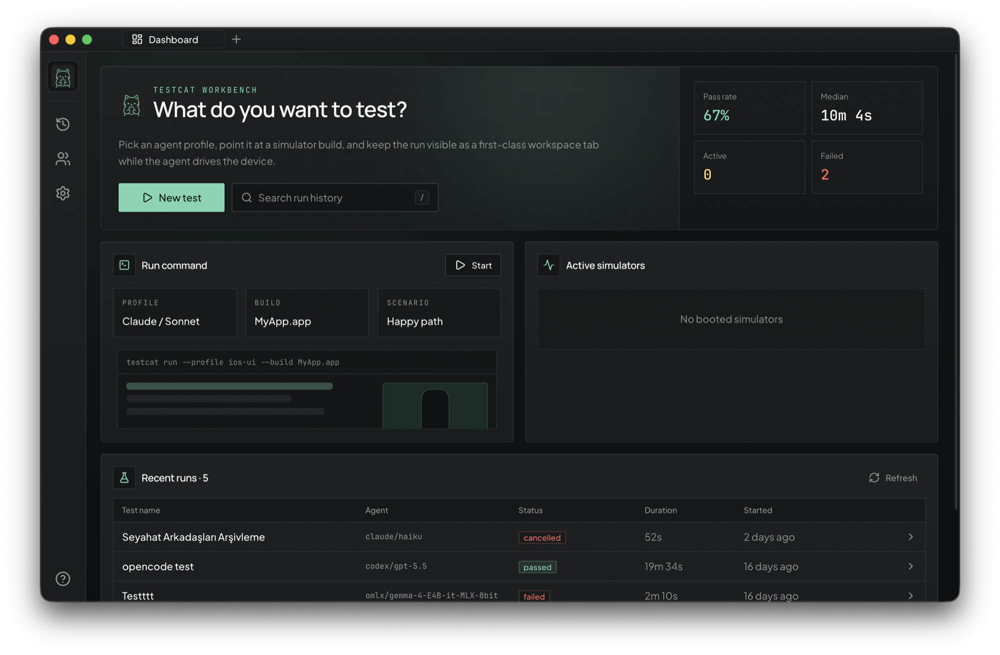

<div align="center">
  <picture>
    <source media="(prefers-color-scheme: dark)" srcset="assets/testcat-dark.svg">
    
  </picture>
  <h1>testcat</h1>
  <p><strong>AI-agent-powered iOS testing — a macOS desktop app.</strong></p>
  <p>Describe a test in plain language. An AI agent runs it on real iOS simulators<br/>(or your iPhone) while you watch live.</p>
</div>

---

<div align="center">
  
</div>

Define a test scenario (name + `.app` build + agent profile + prompt) and hit Run. The agent boots
simulators, installs your build, and works through the scenario — tapping, swiping, typing, reading the
accessibility tree — while you watch its reasoning stream on the left and a live view-only simulator grid on
the right. Every run persists to a local dashboard.

## Features

- **Bring your own agent** — profiles for Claude Code, Codex, opencode, or fully local models through
  Ollama. Model + reasoning-effort pickers read live from each CLI.
- **Live simulator grid** — real-time MJPEG streams of every simulator the run uses, view-only, up to 4
  simulators per run for multi-device scenarios.
- **Physical iOS devices** — drive a real iPhone through an XCUITest runner, including apps installed via
  TestFlight (no build file needed). A free Apple ID is enough to sign the runner.
- **Run dashboard** — every run is stored in SQLite: full chat replay, tool calls, screenshots, network
  activity, verdict, and duration.
- **Local-model assist** — before a weak local model runs, a strong model explores the build once and caches
  an app map + login flow; runs then replay login deterministically with generated per-run accounts.
- **Honest results** — a completion gate rejects "passed" verdicts that lack real executed actions and
  observations, so RL-tuned models can't fake success.
- **Batteries included** — the simulator CLI, the agent control skill, and the QA agent identity ship inside
  the app and install themselves on first launch. An in-app setup guide detects what's missing and offers
  one-click installs.

## How it works

```
Renderer (New Test: name, build, agent profile, scenario, #simulators)
  → run:start → Electron main (orchestrator)
      1. resolve profile + scenario, reserve simulators
      2. spawn the agent CLI (or run the built-in Ollama loop)
         with the testcat-agent identity + testcat-ios skill
      3. parse the output stream → normalized AgentEvent → chat pane   [left]
  ↕ per-simulator `testcat-sim screencast` (MJPEG) → live grid         [right]
  → on exit: verdict + duration + events → SQLite → dashboard
```

Three processes, strictly separated: **Electron main** owns child processes, devices, and the database;
the **renderer** is pure React UI; a sandboxed **preload bridge** is the only line between them.

## Requirements

- macOS on Apple Silicon, with Xcode (for iOS simulators)
- Node ≥ 24 and pnpm 9 (building from source)
- At least one agent runtime: `claude`, `codex`, or `opencode` CLI on PATH, or a local
  [Ollama](https://ollama.com) daemon
- Physical-device runs additionally need an iPhone with Developer Mode enabled and any Apple ID team for
  runner signing

## Install (prebuilt app)

Grab the latest `testcat-<version>-arm64.dmg` from the
[**Releases**](https://github.com/bozkurtemre/testcat/releases/latest) page, drag testcat into
Applications, and you're set — the simulator CLI, device runtime, skill, and agent identity are bundled and
install themselves on first launch. Builds are unsigned: on first open, use right-click → Open (or
`xattr -cr /Applications/testcat.app`).

## Quick start (from source)

```bash
git clone https://github.com/bozkurtemre/testcat.git && cd testcat
pnpm install
make sim-build     # build the native simulator CLI (Swift)
pnpm dev           # launch the desktop app
```

First launch opens the setup guide — it detects your toolchain and installs the bundled agent assets
automatically.

> If `pnpm dev` fails with `Electron uninstall`, run `pnpm rebuild electron` to fetch the Electron binary.

## Build a distributable app

```bash
make desktop-package
```

Produces an unsigned `testcat-<version>-arm64.dmg` (+ `.zip`) in `apps/desktop/release/` with the simulator
CLI, device runtime, skill, and agent identity bundled in. On first open, bypass Gatekeeper with
right-click → Open (or `xattr -cr /Applications/testcat.app`).

## Repository layout

| Path | What it is |
|------|------------|
| `apps/desktop` | Electron app — main orchestrator, preload bridge, React/Vite renderer |
| `packages/shared` | Shared TypeScript types & IPC contracts (`@testcat/shared`) |
| `native/testcat-sim` | Swift simulator CLI: control (tap/swipe/boot/…) + live `screencast` |
| `native/testcat-device` | Physical iOS device CLI (XCUITest runner wrapper) |
| `skills/testcat-ios` | The control skill the spawned agent loads to drive devices |
| `agents/testcat-agent` | The autonomous, read-only QA specialist identity every run assumes |
| `assets` | Brand marks |

## Development

```bash
make help          # all targets
pnpm typecheck     # strict TS across the workspace
pnpm dev           # desktop app in dev mode
make doctor        # typecheck + build + Electron smoke test
```

Architecture, conventions, and gotchas live in [AGENTS.md](AGENTS.md) (canonical, also used by coding
agents). Contributions are welcome — see [CONTRIBUTING.md](CONTRIBUTING.md).

Stack: Electron · React 19 · TypeScript · Tailwind CSS 4 · shadcn/ui · Drizzle + SQLite · Swift ·
pnpm + Turborepo.

## License & acknowledgements

testcat is [MIT licensed](LICENSE). Bundled third-party components keep their own licenses in place:

- `native/testcat-sim` is a fork of [tddworks/baguette](https://github.com/tddworks/baguette)
  (Apache-2.0), with the web/serve layer removed and a headless `screencast` command added.
- `native/testcat-device` vendors portions of
  [callstack/agent-device](https://github.com/callstack/agent-device) (MIT).

macOS only — testcat drives Apple's simulator and device toolchain directly.
